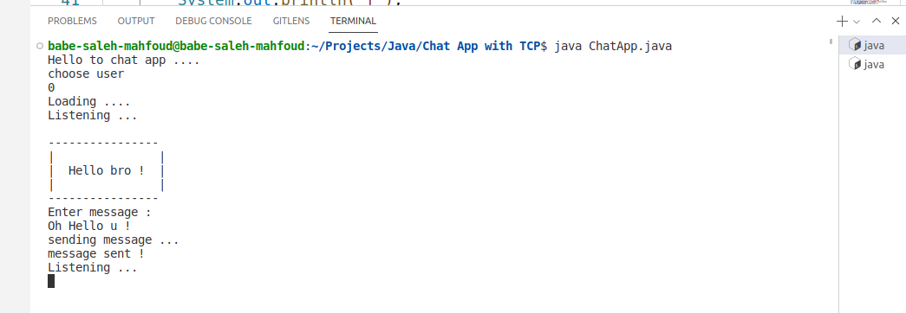
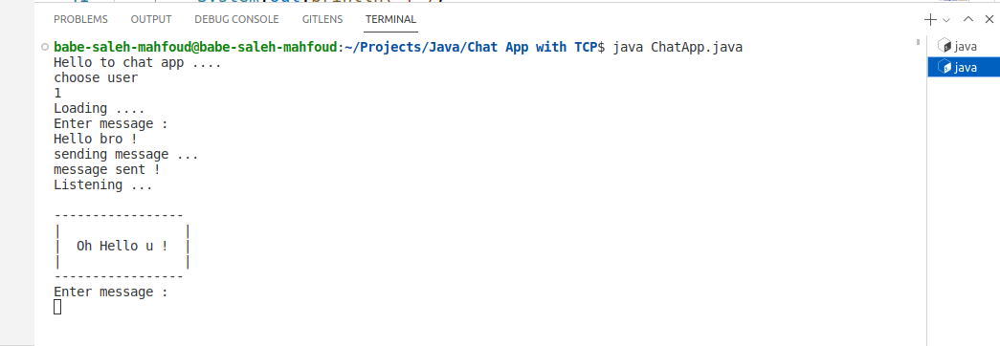

# Terminal Chat App with TCP Sockets

### Preview

|                    User 0                    |                    User 1                    |
| :------------------------------------------: | :------------------------------------------: |
|  |  |

---

Nonsimultaneous chat app in terminal build using [Sockets](https://docs.oracle.com/en/java/javase/19/docs/api/java.base/java/net/Socket.html)
in java.

## Badges

## Contributing

Feel free to fork the project and open you PRs, and i will review and merge them.

## Installation

You only need JDK installed on your machine.

1. Navigate to main folder.
2. open 2 terminal sessions.
3. run java ChatApp.java in each session.
